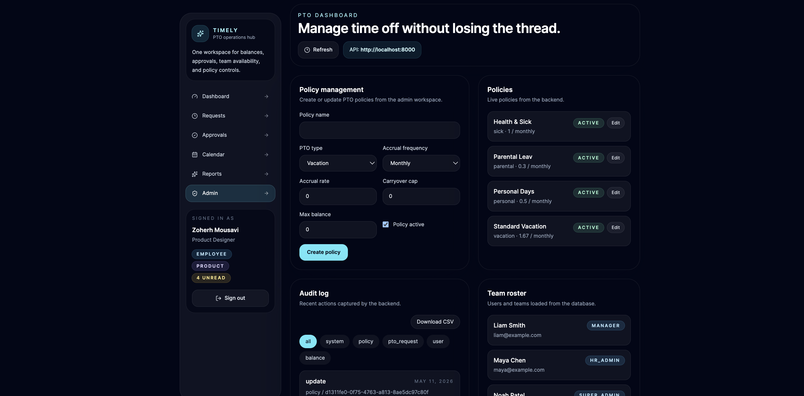

# Timely

Timely is a full-stack PTO management workspace for tracking time off, reviewing requests, managing approvals, and keeping teams aligned with a shared calendar and policy admin tools.

It includes:

- A modern React + Vite frontend
- A FastAPI backend with seeded demo data
- Role-aware dashboard views for employees, managers, HR admins, and super admins
- Responsive layouts designed for desktop and mobile

## Screenshots

| Dashboard                                              |
| ------------------------------------------------------ |
|  |

| Requests                                            | Reports                                          |
| --------------------------------------------------- | ------------------------------------------------ |
|  |  |

| Admin                                  |
| -------------------------------------- |
|  |

## Features

- PTO dashboard with request summaries and balance cards
- Request creation, approval, rejection, and cancellation flows
- Team calendar with PTO and holiday visibility
- Reporting views for usage, approvals, balances, trends, and audit history
- Admin tools for policy management and team roster inspection
- Responsive sidebar and content layouts for smaller screens

## Tech Stack

- Frontend: React, React Router, Vite, Tailwind CSS
- Backend: FastAPI, SQLAlchemy, Pydantic, Uvicorn
- Tooling: ESLint, pnpm, uv

## Project Structure

- `frontend/` - React app and UI assets
- `backend/` - FastAPI service, models, schemas, and API routes
- `docs/pics/` - product screenshots used in this README

## Prerequisites

- Node.js 20+ and pnpm
- Python 3.11+
- `uv` for backend dependency management

## Run Locally

### 1. Start the backend

```bash
cd backend
uv run python main.py
```

The backend runs on `http://localhost:8000`.

### 2. Start the frontend

In a second terminal:

```bash
cd frontend
pnpm install
pnpm dev
```

The frontend runs on `http://localhost:5173` by default.

## Build and Quality Checks

Frontend:

```bash
cd frontend
pnpm build
pnpm lint
```

Backend:

```bash
cd backend
uv run pytest
```

## Notes

- The screenshots in `docs/pics/` are referenced directly from the repository, so they will render on GitHub and in most markdown viewers.
- If you change the frontend port, update `backend/app/core/config.py` or set `FRONTEND_ORIGIN` so CORS matches your dev server.
